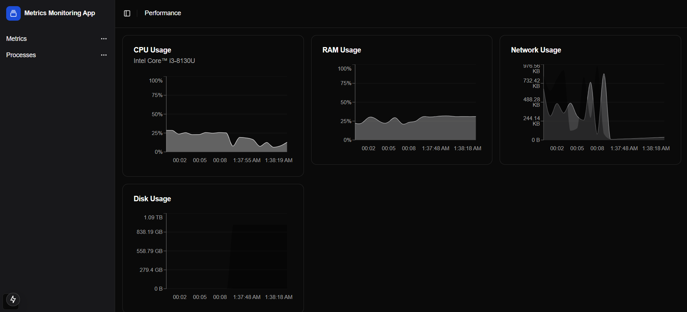

# Cloud Monitoring App



This is a **Cloud Monitoring App** built with **Flask** and **Next.js**, utilizing **Shadcn** for real-time system monitoring. The application is designed to run on **AWS EKS** (Elastic Kubernetes Service) and **AWS ECS** (Elastic Container Service) for scalable and efficient deployment.

## Table of Contents

- [Features](#features)
- [Prerequisites](#prerequisites)
- [Setup Instructions](#setup-instructions)
  - [Cloning the Repository](#cloning-the-repository)
  - [Running Locally with Docker Compose](#running-locally-with-docker-compose)
- [Deploying to AWS EKS](#deploying-to-aws-eks)
  - [Step 1: Create an EKS Cluster](#step-1-create-an-eks-cluster)
  - [Step 2: Build and Push Docker Images](#step-2-build-and-push-docker-images)
  - [Step 3: Deploy to EKS](#step-3-deploy-to-eks)
- [Deploying to AWS ECS](#deploying-to-aws-ecs)
  - [Step 1: Create an ECS Cluster](#step-1-create-an-ecs-cluster)
  - [Step 2: Build and Push Docker Images](#step-2-build-and-push-docker-images-1)
- [Conclusion](#conclusion)

## Features

- **Real-time Monitoring**: Provides real-time system metrics and monitoring.
- **Flask API**: Backend API built with Flask.
- **Next.js Frontend**: Frontend built with Next.js and Shadcn.
- **AWS EKS**: Deployed on AWS Elastic Kubernetes Service for scalability and high availability.
- **AWS ECS**: Optionally deployable on AWS Elastic Container Service.

## Prerequisites

Ensure you have the following tools and services set up before starting:

- **Docker**
- **Kubernetes (kubectl)**
- **AWS CLI**
- **AWS EKS** or **AWS ECS** cluster setup

## Setup Instructions

### Cloning the Repository

To clone this repository, run the following commands:
```
git clone git@github.com:Junaid-sadiq/Cloud-Monitoring-App.git
cd Cloud-Monitoring-App

```
### Running Locally with Docker Compose
To run the application locally using Docker Compose:

Access the Flask API at http://localhost:5000 and the Next.js frontend at http://localhost:3000.

### Deploying to AWS EKS
## Step 1: Create an EKS Cluster
Create EKS Cluster: Please follow the AWS documentation to create an EKS cluster.
```
aws eks update-kubeconfig --region <region> --name <cluster_name>

```

## Step 2: Build and Push Docker Images
# 1. Build Docker Images:
```
docker build -t my_monitoring_app_image_flask:latest ./flask_api
docker build -t my_monitoring_app_image_nextjs:latest ./my-metric-dashboard
```

# 2. Tag Docker Images:

```
docker tag my_monitoring_app_image_flask:latest <your_ecr_repository>/my_monitoring_app_image:flask
docker tag my_monitoring_app_image_nextjs:latest <your_ecr_repository>/my_monitoring_app_image:nextjs

```

# 3. Push Docker Images to ECR:

```
aws ecr get-login-password --region <region> | docker login --username AWS --password-stdin <your_ecr_repository>
docker push <your_ecr_repository>/my_monitoring_app_image:flask
docker push <your_ecr_repository>/my_monitoring_app_image:nextjs
```

## Step 3: Deploy to EKS

# 1. Apply Kubernetes Manifests: Use the provided Kubernetes manifests to deploy the application to EKS:
```
kubectl apply -f k8s/flask-deployment.yaml
kubectl apply -f k8s/nextjs-deployment.yaml
kubectl apply -f k8s/flask-service.yaml
kubectl apply -f k8s/nextjs-service.yaml
```

# 2. Verify Deployment: Ensure that the pods are running and the services are accessible:
```
kubectl get pods
kubectl get services
```

### Deploying to AWS ECS
## Step 1: Create an ECS Cluster
Create ECS Cluster: Follow the AWS documentation to create an ECS cluster.

## Step 2: Build and Push Docker Images
# 1.Build Docker Images:
```
docker build -t my_monitoring_app_image_flask:latest ./flask_api
docker build -t my_monitoring_app_image_nextjs:latest ./my-metric-dashboard
```

# 2.Tag Docker Images:
```
docker tag my_monitoring_app_image_flask:latest <your_ecr_repository>/my_monitoring_app_image:flask
docker tag my_monitoring_app_image_nextjs:latest <your_ecr_repository>/my_monitoring_app_image:nextjs
```

# 3.Push Docker Images to ECR:
```
aws ecr get-login-password --region <region> | docker login --username AWS --password-stdin <your_ecr_repository>
docker push <your_ecr_repository>/my_monitoring_app_image:flask
docker push <your_ecr_repository>/my_monitoring_app_image:nextjs
```

## Step 3: Deploy to ECS
Create Task Definitions: Define task definitions for the Flask and Next.js services.

Create Services: Create ECS services using the task definitions.

Verify Deployment: Ensure that the tasks are running and the services are accessible.

### Conclusion
This Cloud Monitoring App provides real-time system monitoring using Flask and Next.js, and can be deployed on AWS EKS or ECS for scalable and efficient deployment. Follow the steps provided to clone the repository, run the application locally, and deploy it to AWS.


